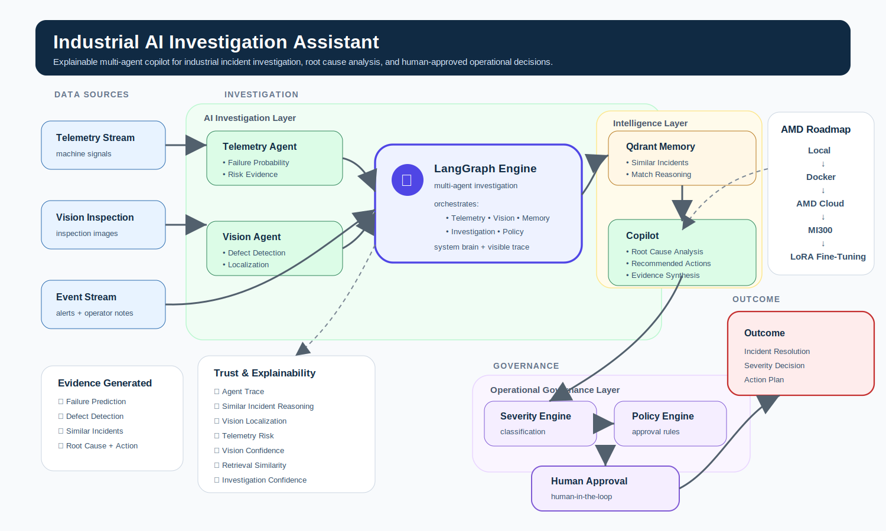
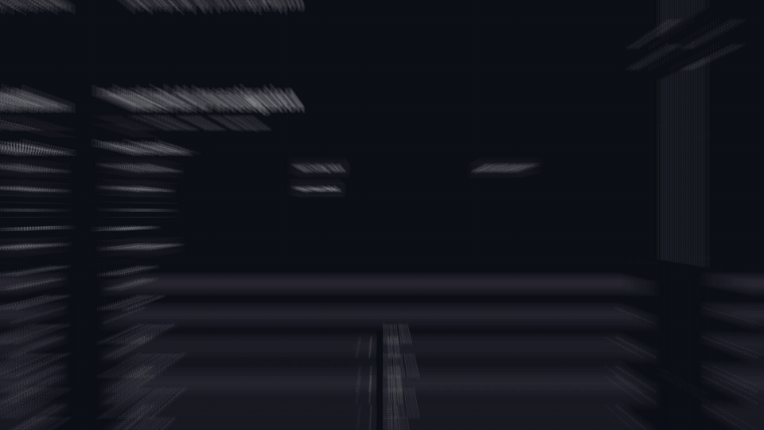
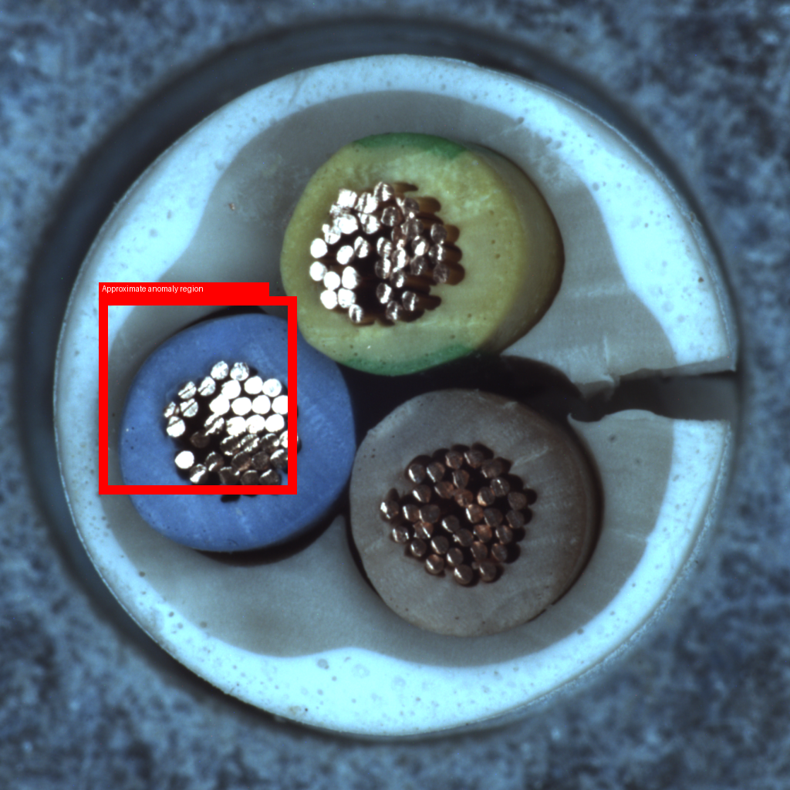
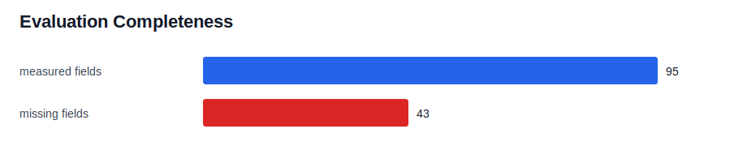
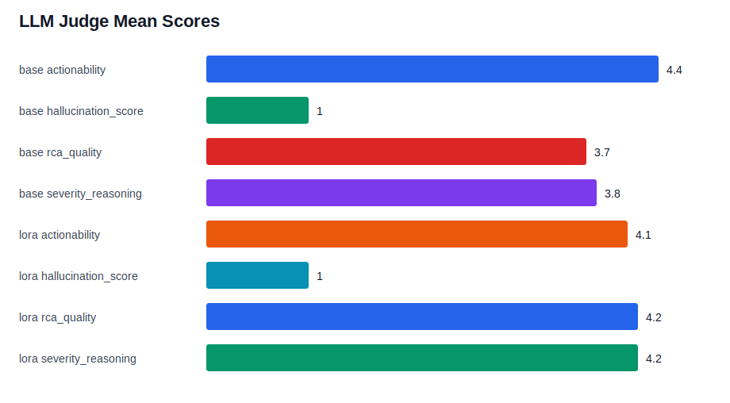

# Industrial AI Assistant



**A local-first industrial incident investigation copilot that connects telemetry, vision, similar-incident memory, root-cause analysis, severity policy, and human approval.**

The project demonstrates a production-minded pattern for industrial AI: do not bolt a chatbot onto plant data. Build an evidence workflow.

<p>
  
  
  
  
  
  
  
  
</p>

## Live Demo



Demo GIF generated from the hackathon dashboard workflow.

## Key Results

| Metric | Result |
| --- | ---: |
| ROC AUC | 0.97 |
| Policy Accuracy | 12/12 |
| LoRA RCA Score | 4.2 |
| ROCm Speedup | 6.2× |
| Tests Passing | 124 |
| Incident Corpus | 300 |

## Repository Status

| Area | Status |
| --- | --- |
| Demo Application | Complete |
| Evaluation Framework | Complete |
| ROCm Benchmarking | Complete |
| LoRA Experiment | Complete |
| Documentation | Complete |
| Security Hardening | Complete |

## Project Highlights

| Highlight | What It Proves |
| --- | --- |
| **Multi-evidence workflow** | Telemetry, images, prior incidents, policy, and approval state are handled as one investigation. |
| **Retrieval-first RCA** | Qdrant incident memory is treated as the factual authority, not model memory. |
| **Human approval by design** | High-impact recommendations are gated by deterministic policy and approval records. |
| **AMD path is real** | MI300X-class evaluation artifacts, BF16 LoRA, ROCm runtime telemetry, and reranking benchmarks are included. |
| **Demo remains local-first** | JSON files, local Qdrant, Ollama-compatible RAG, deterministic fallback, and Docker Compose. |
| **Evaluation-first engineering** | Severity scenarios, LLM-as-judge, LoRA comparison, ROCm benchmark, and completeness reporting. |

## Investigation Workflow

```text
🚨 Detect Failure
      ↓
👁️ Localize Defect
      ↓
🧠 Retrieve Similar Incidents
      ↓
📋 Generate RCA
      ↓
⚠️ Assign Severity
      ↓
👤 Request Approval
```

Each investigation moves from machine and visual signals into grounded memory, policy, and human review.

## Industrial AI Is Not A Chatbot Problem

Industrial incidents are not solved by one prompt. Operators need to know:

| Question | Evidence Source |
| --- | --- |
| Is this machine likely to fail? | XGBoost telemetry model |
| Is there visible damage? | MVTec anomaly detection and localization |
| Have we seen this before? | Qdrant similar-incident memory |
| What is the likely root cause? | Grounded RAG answer with deterministic fallback |
| How severe is it? | Deterministic severity policy |
| Can the action proceed? | Human approval workflow |

```text
Telemetry -> Vision -> Incident Memory -> RCA -> Severity -> Human Approval
```

## What Makes This Different

| Traditional Chatbot | Industrial AI Assistant |
| --- | --- |
| Single prompt in, answer out | Multi-stage investigation workflow |
| Relies on model memory | Grounds RCA in retrieved incidents |
| Weak connection to sensor state | Uses telemetry risk and telemetry-aware reranking |
| No visual explainability | Uses anomaly scores, heatmaps, and annotated outputs |
| Lets the model imply severity | Uses deterministic severity policy |
| No operational control point | Creates human approval records |
| Hard to evaluate | Ships deterministic tests, LLM judge, and benchmark artifacts |

## Demo

| Investigation | Visual Inspection | Evaluation |
| --- | --- | --- |
|  |  |  |
| Visible workflow trace | Bounding-box style visual evidence | Packaged evaluation coverage |

## Architecture



| Layer | Implementation |
| --- | --- |
| Telemetry | AI4I-style XGBoost failure prediction |
| Vision | Comparison detector, autoencoder, ResNet detector, localization artifacts |
| Memory | Qdrant with `sentence-transformers/all-MiniLM-L6-v2` embeddings |
| RAG | Deterministic answer generation plus optional local Ollama synthesis |
| Workflow | LangGraph node sequence with visible traces |
| Policy | Deterministic SEV1/SEV2/SEV3 rules |
| Approval | JSON-backed human approval lifecycle |
| UI | Streamlit dashboard |
| Evaluation | Scenario harness, LLM judge, report packaging, ROCm benchmarks |

## Features

| Capability | Status | Notes |
| --- | --- | --- |
| Predictive maintenance telemetry | Built | XGBoost over AI4I-style features |
| Visual anomaly detection | Built | MVTec comparison, autoencoder, ResNet paths |
| Similar incident retrieval | Built | Qdrant local vector memory |
| Telemetry-aware reranking | Built | Combines vector similarity with operating context |
| Grounded RCA assistant | Built | Deterministic fallback remains operational |
| Local LLM mode | Built | Ollama-compatible, optional |
| LangGraph orchestration | Built | Linear, inspectable agent trace |
| Severity policy engine | Built | Deterministic, tested policy |
| Human approval workflow | Built | JSON persistence for demo |
| Unified evaluation package | Built | Markdown/HTML/JSON/CSV/charts |
| AMD LoRA experiment | Built | BF16 Qwen run captured in artifacts |
| ROCm reranking benchmark | Built | rocBLAS + Triton benchmark path |

## Evaluation

Metric policy: this README uses measured repository artifacts only. Missing metrics stay out of the headline table.

| Area | Measured Result |
| --- | ---: |
| Historical telemetry ROC AUC | `0.97` |
| Historical telemetry average precision | `0.70` |
| Incident corpus | `300` documents from `100` AI4I failure rows |
| Embedding size | `384` |
| Severity scenario accuracy | `12/12` |
| LLM judge set | `20` candidate responses, `20` judge records |
| LoRA RCA quality | `4.2` vs base `3.7` |
| LoRA severity reasoning | `4.2` vs base `3.8` |
| Hallucination score | `1.0` base and LoRA |
| Evaluation package completeness | `70.5%` |
| Tests after hardening pass | `124 passed` |



## Why Retrieval Matters More Than Fine-Tuning

Fine-tuning and retrieval solve different problems.

| Fine-Tuning Helps With | Retrieval Must Own |
| --- | --- |
| Domain vocabulary | Current incident evidence |
| Response structure | Recent maintenance history |
| RCA writing style | Similar incident records |
| Severity explanation style | Changing plant conditions |
| Maintenance phrasing | Audit-ready grounding |

This project uses both, but retrieval is the factual authority. LoRA can make the answer layer better at using evidence; it should not become the source of operational truth.

## Why Human Approval Matters

Industrial recommendations can affect safety, downtime, maintenance cost, and production quality. The assistant is a copilot, not an autonomous actor.

| Control | Implementation |
| --- | --- |
| Severity assignment | Deterministic policy engine |
| High-impact action gate | Approval required for SEV1 |
| Auditability | JSON approval records in demo mode |
| Fallback behavior | Deterministic investigation remains available without LLM |
| Future production path | Durable approvals, RBAC, audit logs, monitoring |

## AMD Optimization

AMD is not a logo in this project. It is tied to measured artifacts:

| AMD Area | Artifact |
| --- | --- |
| BF16 LoRA | Qwen3-4B adapter evaluation on MI300X-class environment |
| LLM-as-judge | Qwen3-14B via OpenAI-compatible local endpoint |
| ROCm runtime | Torch `2.8.0`, ROCm `7.0`, vLLM runtime capture |
| Reranking benchmark | rocBLAS + Triton score fusion |

### Optimization Path

```text
PyTorch FP32 Eager
      ↓
rocBLAS
      ↓
rocBLAS + Triton
      ↓
6.2× Speedup
```

| ROCm Benchmark Result | Value |
| --- | ---: |
| Best path | `rocblas_plus_triton_score` BF16 |
| Latency | `1.039 ms` |
| Speedup vs PyTorch FP32 eager | `6.204x` |
| Candidates/sec | `30,802,253,299.700` |
| Top-k overlap | `0.997` |



## Tech Stack

| Layer | Stack |
| --- | --- |
| App | Streamlit |
| Workflow | LangGraph |
| Telemetry ML | pandas, scikit-learn, XGBoost |
| Vision | PyTorch, torchvision, MVTec-style detectors |
| Vector memory | Qdrant, sentence-transformers |
| RAG | deterministic formatter, optional Ollama |
| Governance | severity policy, JSON approvals |
| Evaluation | pytest, LLM-as-judge, report packaging |
| AMD | ROCm, rocBLAS, Triton, BF16 LoRA |
| Packaging | Docker, Docker Compose, Makefile |

## Quick Start

```bash
python -m venv .venv
.venv/bin/python -m pip install -r requirements.txt
cp .env.example .env
make test
make run-ui
```

Useful commands:

| Task | Command |
| --- | --- |
| Run UI | `make run-ui` |
| Run tests | `make test` |
| Run deterministic eval | `make eval` |
| Check lint | `make lint` |
| Start Docker demo | `make docker-up` |

Full setup, data prep, troubleshooting, Docker, evaluation, and operations notes live in [docs/README_DETAILED.md](docs/README_DETAILED.md).

## Repository Structure

```text
src/industrial_ai/
  telemetry/    predictive maintenance
  vision/       visual anomaly detection
  incidents/    Qdrant memory and reranking
  rag/          RCA answer generation
  policy/       severity rules
  approvals/    human approval records
  demo/         Streamlit and workflow facade
  evaluation/   test rigs and judge utilities
  config/       settings and logging
  security/     redaction and validation
```

## Future Roadmap

| Horizon | Direction |
| --- | --- |
| 30 days | SHAP-style telemetry explainability, labeled retrieval relevance set, persisted LangGraph traces |
| 90 days | LangSmith or OpenTelemetry traces, larger judge set, citation accuracy scoring, token/TTFT capture |
| 180 days | Streaming ingestion pilot, shared vector memory, model gateway, audit-grade approvals |

## Project Showcase

This repository includes:

- Streamlit dashboard
- LangGraph workflow
- Retrieval-augmented investigations
- Visual anomaly detection
- Deterministic governance
- Human approval workflow
- LoRA adaptation experiments
- ROCm optimization benchmarks
- Unified evaluation package

## Acknowledgements

| Project / Platform | Role |
| --- | --- |
| AMD Developer Cloud | MI300X-class experimentation, BF16 LoRA, ROCm runtime capture |
| Qdrant | Local incident vector memory |
| LangGraph | Explicit workflow orchestration |
| Streamlit | Demo dashboard |
| Ollama / OpenAI-compatible local serving | Optional local RAG synthesis and judge path |
| MVTec AD | Visual inspection dataset pattern |
| AI4I | Predictive maintenance telemetry dataset pattern |

## License

Released under the MIT License.

---

For the full technical reference, see [docs/README_DETAILED.md](docs/README_DETAILED.md).
