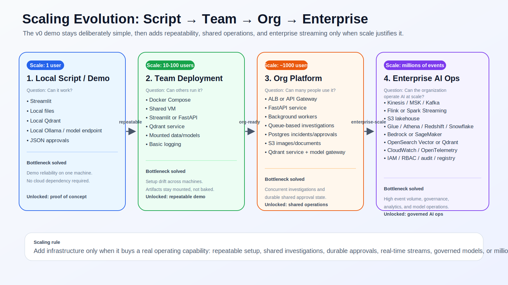
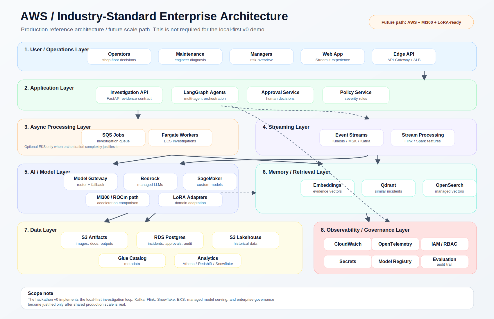

# Industrial AI Investigation Assistant Architecture

## Executive Summary

The Industrial AI Investigation Assistant is a local-first operations copilot for maintenance and quality teams. It combines predictive telemetry, visual inspection, similar incident memory, RAG investigation, severity policy, and human approval into one explainable workflow.

In under 30 seconds: sensor and vision signals enter a LangGraph investigation flow; XGBoost estimates machine risk; vision checks surface defects; Qdrant retrieves similar incidents; a model-agnostic Investigation Copilot drafts root-cause analysis and recommended actions with deterministic fallback; a severity engine applies policy; a human approval step controls high-impact actions. The result is not a generic chatbot. It is an evidence-driven industrial investigation loop with auditability, explainability, and an AMD MI300 path for future acceleration and LoRA adaptation.

## System Overview


Strategic signals:

- **Local First:** demo operates with local files, local Qdrant, local LLM serving, and deterministic fallbacks.
- **Human in the Loop:** severe recommendations flow through explicit approval records.
- **Explainable AI:** telemetry evidence, visual localization, similar incident reasons, and policy inputs are visible.
- **AMD MI300 Ready:** benchmark and packaging paths prepare the project for ROCm comparison on AMD Cloud.
- **LoRA Ready:** incident corpus can be converted into train/eval instruction JSONL without training yet.

## Component Inventory

| Component | Current implementation | Role |
|---|---|---|
| Telemetry Agent | `industrial_ai.telemetry` | AI4I-style failure probability, risk level, feature evidence |
| Vision Agent | `industrial_ai.vision` | comparison, autoencoder, ResNet anomaly checks and localization artifacts |
| Incident Memory | `industrial_ai.incidents.memory` | local Qdrant indexing, retrieval, telemetry-aware reranking |
| Investigation Copilot/RAG | `industrial_ai.rag.answer` | deterministic RAG plus local LLM synthesis with fallback |
| Severity Engine | `industrial_ai.policy.severity` | deterministic policy mapping evidence to severity |
| Approval Workflow | `industrial_ai.approvals.approval` | JSON-backed approval records |
| Orchestrator | `industrial_ai.demo.graph_workflow` | LangGraph START to END sequence with visible agent trace |
| Event Stream | `industrial_ai.plant.stream` | demo plant events, trigger detection, investigation launch |
| UI | `industrial_ai.demo.streamlit_app` | Streamlit dashboard for investigations, stream, evaluation, policy |
| Benchmarking | `scripts/benchmark_llm.py` | local/Ollama and future OpenAI-compatible ROCm latency metrics |
| LoRA Data Prep | `scripts/prepare_lora_dataset.py` | instruction JSONL generation from incident corpus |

## Data Flow

The hero architecture diagram covers the end-to-end data story: telemetry, vision, and event stream inputs flow into the LangGraph investigation engine; the engine combines telemetry risk, vision evidence, Qdrant similar incident memory, and the model-agnostic Investigation Copilot; governance then applies severity policy and human approval before producing the final incident recommendation.

Persistent local artifacts:

- `data/incidents/ai4i_incident_corpus.jsonl`
- `data/qdrant/`
- `data/approvals/`
- `data/plant/events.jsonl`
- `data/benchmarks/`
- `data/lora/`
- `models/`

## Agent Workflow

The LangGraph workflow is intentionally linear and visible:

```text
START
  -> telemetry_agent
  -> vision_agent
  -> memory_agent
  -> rag_agent
  -> severity_agent
  -> approval_agent
  -> END
```

Each node adds trace text. That trace is surfaced to users so the demo shows what happened rather than hiding the reasoning inside a black-box response.

## Human Approval Workflow

Human approval is not an afterthought. It is a control point between AI-generated recommendations and operational action.

The workflow records whether approval is required, pending, approved, rejected, or not required. Severe or policy-sensitive recommendations stay in a review state until a human decision is recorded.

## Evaluation & Benchmarking

Evaluation is demo-oriented but concrete:

- Held-out correctness rig for telemetry, vision, policy, and approvals.
- Streamlit evaluation tab shows pass/fail count, pass rate, and scenario details.
- LLM benchmark harness records local/Ollama and future OpenAI-compatible endpoint metrics:
  - total latency
  - time to first token
  - generation latency
  - token counts when available
  - p50, p95, p99 summaries

The intent is to compare a local CPU/Ollama baseline against future AMD MI300 ROCm serving results without requiring AMD hardware locally.

## Deployment Architecture

Docker packaging includes:

- Streamlit app container.
- Qdrant service container.
- Mounted `data/` and `models/`.
- Environment variables for Ollama and future Qdrant/OpenAI-compatible endpoints.

The non-Docker local workflow remains unchanged.

## Scaling Path



The scaling evolution diagram separates the hackathon demo from the future platform path:

- **Local Script / Demo:** the current system is local-first, inspectable, and reliable for one-user demonstrations.
- **Team Deployment:** Docker Compose and a shared VM make the demo repeatable without baking datasets, model weights, or Qdrant indexes into the image.
- **Org Platform:** queues, workers, Postgres, S3, a model gateway, and service-backed Qdrant become useful when teams share investigations and approvals.
- **Enterprise AI Ops:** streaming, lakehouse analytics, managed model serving, OpenTelemetry, IAM/RBAC, audit trails, MI300 benchmarking, and LoRA adaptation become relevant at millions-of-events scale.



The AWS / industry-standard diagram is a production reference architecture and future scale path. It shows how the same investigation concept could map onto familiar enterprise layers: operations UI, API edge, investigation services, queue-backed workers, streaming feature generation, model serving, vector memory, durable data stores, observability, and governance.

Evolution principles:

- Keep the demo understandable.
- Add infrastructure only when the workflow proves useful.
- Preserve deterministic fallback and human controls.
- Treat enterprise streaming, cloud persistence, and managed governance as future platform capabilities, not hackathon dependencies.

## Why This Is Not Implemented in v0

The current project is a local-first hackathon demo, not a production platform. Kafka, Flink, Spark, Snowflake, Redshift, EKS, managed Bedrock/SageMaker deployment, and enterprise IAM are intentionally not part of v0 because they would add operational work without improving the core judging story.

The v0 value is the investigation loop itself: telemetry prediction, vision inspection, similar incident retrieval, model-agnostic investigation synthesis, severity policy, human approval, visible traces, and deterministic fallback. That loop must remain easy to run on a laptop or AMD Cloud VM.

Enterprise infrastructure becomes justified only when the demo has to support shared teams, durable audit requirements, real-time plant streams, governed model operations, or high event volume. Until then, local files, local Qdrant, Docker Compose, and clear setup scripts are the right level of complexity.

## When Each AWS Service Becomes Justified

| Service or pattern | Use when |
|---|---|
| API Gateway or ALB | Multiple users or clients need a stable HTTP entry point. |
| FastAPI service | The investigation workflow needs to be called by apps, jobs, or other systems. |
| SQS | Investigations need queueing, retry, backpressure, or asynchronous execution. |
| ECS/Fargate workers | Many investigations need to run concurrently without managing servers directly. |
| EKS | Advanced scheduling, multi-service platform operations, or specialized GPU orchestration justify Kubernetes complexity. |
| Kinesis or MSK/Kafka | Plant events arrive continuously and need durable streaming ingestion. |
| Flink or Spark Streaming | Real-time feature generation, windowing, joins, and stream enrichment become necessary. |
| S3 | Images, documents, benchmark outputs, and generated artifacts need durable object storage. |
| RDS Postgres | Incidents, approvals, audit state, users, and workflow status need transactional persistence. |
| S3 lakehouse | Historical telemetry, vision outputs, and event archives need long-term analytical storage. |
| Glue catalog | Lakehouse data needs discoverable schemas and governed metadata. |
| Athena, Redshift, or Snowflake | Operations and leadership need BI, historical analytics, or cross-domain reporting. |
| Bedrock | Managed LLM access is preferred over self-hosted model serving. |
| SageMaker | Custom models, endpoint management, evaluation jobs, or controlled deployment workflows are needed. |
| Model gateway/router | Multiple model endpoints, fallbacks, cost controls, or AMD-optimized routes need a common contract. |
| Qdrant service or OpenSearch Vector | Similar incident retrieval must be shared, scaled, monitored, and backed up. |
| CloudWatch | Production logs and metrics need a managed AWS destination. |
| OpenTelemetry | Cross-service traces are needed to debug agent, retrieval, model, and approval latency. |
| IAM/RBAC | Different operator, engineer, manager, and admin permissions must be enforced. |
| Secrets Manager | Model endpoints, database credentials, and service tokens must be rotated and protected. |
| Model registry | Base models, LoRA adapters, prompts, benchmark results, and approvals need versioned governance. |

## Decision Records

### Why Qdrant

Qdrant provides local vector memory with a clear path from a small incident corpus to service-backed retrieval. It supports the "similar incidents" story better than a flat keyword search and remains easy to run locally.

### Why LangGraph

LangGraph makes the agent sequence explicit. Judges and engineers can see the investigation path: telemetry, vision, memory, RAG, severity, approval. This is easier to explain and audit than a single prompt chain.

### Why Local-First

The project targets a reliable hackathon demo. Local-first design avoids cloud dependency failures, allows deterministic fallback, and makes the system easy to inspect.

### Why Human Approval

Industrial actions can be high-impact. Human approval keeps the assistant as a copilot, not an autonomous maintenance actor.

### Why Deterministic Fallback

LLM calls can fail, be slow, or be unavailable. Deterministic fallback keeps investigations operational and makes demo behavior reliable.

### Why Local LLM Serving

Local LLM serving supports experimentation, simple runtime observability, and a future bridge to GPU-accelerated serving without making the current demo dependent on a proprietary cloud. The architecture is model-agnostic: Gemma, Qwen, Llama, DeepSeek, LoRA-adapted models, or AMD-optimized models can occupy the copilot role.

### Why LoRA Instead Of Full Fine Tuning

LoRA is the pragmatic next step for domain adaptation. It requires less compute and storage than full fine tuning, fits an AMD MI300 experimentation path, and can adapt style and terminology while preserving a small base model.

### Why Docker Packaging

Docker Compose gives a low-friction AMD Cloud path: build once, mount local artifacts, start Streamlit and Qdrant, and avoid baking datasets or model weights into the image.

## Future Enhancements

Current:

- Telemetry prediction
- Vision inspection
- Similar incident retrieval
- RAG investigation
- Similar incident explainability
- Event streams
- Human approval
- LLM benchmarking
- LoRA dataset preparation

Next:

- LoRA fine tuning on AMD MI300
- ROCm benchmark comparisons
- Production observability
- Enterprise persistence
- Real-time streaming
- Stronger model governance workflows

## AMD Cloud / MI300 Path

AMD Cloud work should proceed in stages:

1. Run Docker Compose on AMD Cloud with the existing local-first workflow.
2. Run local/Ollama benchmark baseline on the VM.
3. Add ROCm-backed serving, likely OpenAI-compatible vLLM, for a selected small instruction model.
4. Compare latency, TTFT, and tokens/sec against local CPU baseline.
5. Train or load LoRA adapters once dataset quality is validated.
6. Re-run benchmark and held-out investigation prompts.

The current repo does not require ROCm locally and does not claim GPU performance without AMD hardware.

## LoRA Roadmap

The LoRA dataset generator converts the incident corpus into instruction examples:

- RCA generation
- recommended action generation
- severity explanation
- maintenance summary
- evidence extraction

Future LoRA work should evaluate:

- base model vs adapter on held-out incidents
- evidence faithfulness
- policy consistency
- latency impact on MI300
- whether adapter outputs improve operator-facing summaries without weakening fallback behavior

## Operational Considerations

### Security

- Do not bake datasets, model files, Qdrant indexes, or secrets into containers.
- Keep external endpoints configurable.
- Use local files for demo persistence and avoid unmanaged cloud dependencies.

### Auditability

- Approval records are JSON-backed.
- Agent traces are visible.
- Policy inputs are displayed.
- Benchmark outputs are JSONL and timestamped.

### Explainability

- Telemetry evidence shows feature-level signals.
- Vision evidence can include localization artifacts.
- Similar incidents include "why matched" reasons, score breakdown, and telemetry comparison.
- Severity decisions expose policy reasons and inputs.

### Human-in-the-loop Controls

- Severe incidents can require approval.
- Recommendations are presented as operator-facing outputs.
- The system supports reject/approve states rather than automatic high-impact action.

### Model Governance

- Deterministic fallback remains the reliability baseline.
- LLM metadata and fallback reason are surfaced.
- LoRA is staged as future controlled adaptation.
- Benchmarks should be tied to model, endpoint, hardware label, and timestamp.

## Supporting Diagram Files

- `docs/diagrams/hero_architecture.mmd`
- `docs/diagrams/scaling_evolution.mmd`
- `docs/diagrams/aws_enterprise_architecture.mmd`
- `docs/diagrams/architecture_overview.drawio`
- `docs/assets/architecture_hero.svg`
- `docs/assets/scaling_evolution.svg`
- `docs/assets/aws_enterprise_architecture.svg`
