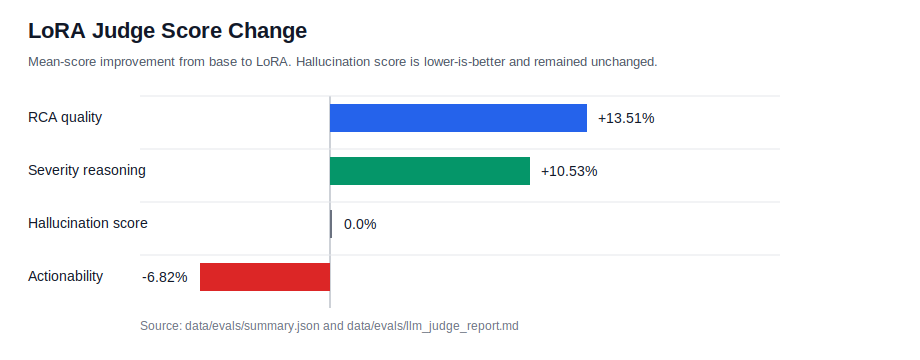
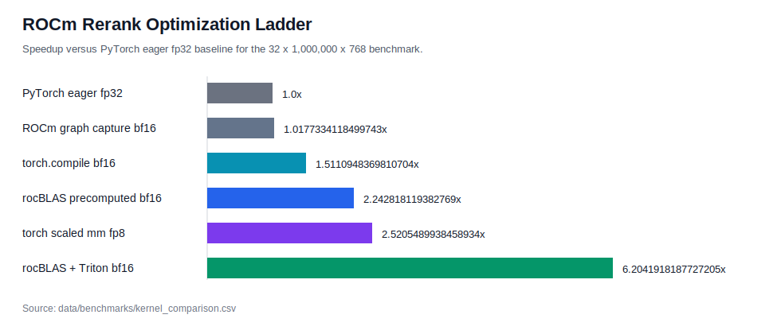
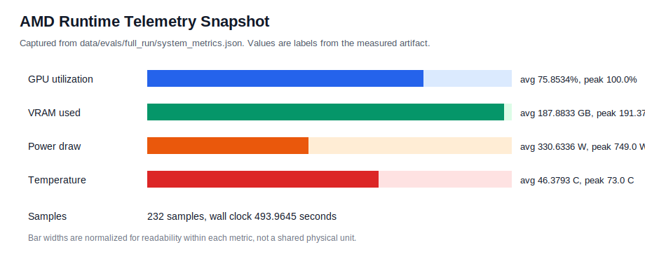
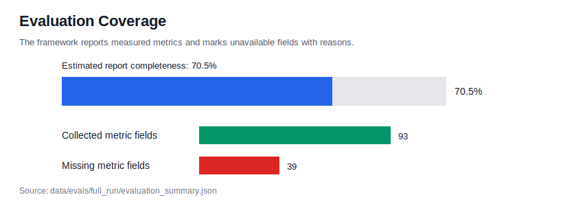

# Industrial AI Assistant

## Final Technical Report

**Judge-Facing and Portfolio Review Edition**

Generated from repository artifacts on 2026-06-12.

Primary thesis:

```text
Reliable industrial AI = predictive signals + visual evidence + incident memory + policy + human oversight.
```

Prepared for:

- Hackathon judges
- Engineering hiring managers
- ML engineers
- Platform and applied AI engineers

Scope note: this document separates the implemented local-first demo from the future production architecture. It does not change metrics, invent results, or claim production impact.

<div class="page-break"></div>

## Table of Contents

- [Executive Summary](#executive-summary)
- [What Was Actually Built](#what-was-actually-built)
- [Key Contributions](#key-contributions)
- [Industrial AI Assistant](#industrial-ai-assistant)
- [Technical Innovations](#technical-innovations)
- [At a Glance](#at-a-glance)
- [Project Thesis](#project-thesis)
- [Why Not Use LLM Alone?](#why-not-use-llm-alone)
- [System Overview](#system-overview)
- [Investigation Timeline](#investigation-timeline)
- [Why This Is A System, Not A Chatbot](#why-this-is-a-system-not-a-chatbot)
- [Business Relevance](#business-relevance)
- [Why AMD Cloud](#why-amd-cloud)
- [Why Retrieval Matters More Than Fine-Tuning](#why-retrieval-matters-more-than-fine-tuning)
- [Engineering Tradeoffs](#engineering-tradeoffs)
- [Engineering Lessons Learned](#engineering-lessons-learned)
- [Data and Intelligence Layers](#data-and-intelligence-layers)
- [Agent Workflow](#agent-workflow)
- [Evaluation Stack](#evaluation-stack)
- [ROCm Optimization](#rocm-optimization)
- [Production Scaling Vision](#production-scaling-vision)
- [LangSmith Future Stack](#langsmith-future-stack)
- [Security and Governance](#security-and-governance)
- [Limitations](#limitations)
- [Roadmap](#roadmap)
- [Conclusion](#conclusion)
- [Appendices](#appendix-a-generated-diagrams-and-chart-assets)

<div class="page-break"></div>

## Executive Summary

The Industrial AI Assistant is a local-first industrial incident investigation copilot. It combines telemetry prediction, visual inspection, similar-incident retrieval, RAG answer generation, deterministic severity policy, human approval, LangGraph orchestration, Streamlit UX, LLM-as-judge evaluation, LoRA experimentation, AMD MI300X runtime telemetry, and ROCm reranking benchmarks.

Metric policy: this report does not invent metrics. Exact measured values are used where artifacts exist. Missing metrics remain explicitly marked as `NOT AVAILABLE`.

Metric interpretation:

| Metric Class | Interpretation |
| --- | --- |
| Current Measured Run | Metrics generated from the final evaluation package and AMD experiments. |
| Historical Development Results | Metrics generated during iterative development and retained for context. |

Historical results are clearly labeled and are not mixed with current measured runs.

The project demonstrates a practical applied AI pattern for industrial operations: AI should not be a single chatbot bolted onto plant data. It should be an evidence-driven workflow that connects machine telemetry, inspection images, prior incidents, operational policy, and human review. The project deliberately favors system design, evaluation, and governance over model-centric experimentation.

Current working flow:

```text
Telemetry or plant event
  -> telemetry_agent: XGBoost failure probability and evidence
  -> vision_agent: optional MVTec defect detection and localization
  -> memory_agent: Qdrant similar incident retrieval with telemetry-aware reranking
  -> rag_agent: deterministic or Ollama-backed grounded answer with fallback
  -> severity_agent: deterministic SEV policy
  -> approval_agent: JSON-backed approval state
  -> Streamlit dashboard and evaluation artifacts
```

Measured highlights:

| Area | Result |
| --- | ---: |
| Historical telemetry ROC AUC | `0.97` |
| Historical telemetry average precision | `0.70` |
| Incident corpus | `300` documents from `100` AI4I failure rows |
| Qdrant vector size | `384` cosine embeddings |
| Severity scenario accuracy | `1.0` across `12` scenarios |
| LLM-as-judge set | `10` incidents, `20` candidate responses, `20` judge records |
| LoRA RCA quality | `4.2` vs base `3.7` |
| LoRA severity reasoning | `4.2` vs base `3.8` |
| Hallucination score | `1.0` base and LoRA, lower is better |
| Best ROCm speedup | `6.2×` |
| Best ROCm latency | `1.04 ms` |
| Evaluation package completeness | `70.5%` |

Telemetry performance metrics were generated during development and are retained as historical benchmark results. The final packaged evaluation run did not include the original telemetry metrics artifact and therefore marks those fields unavailable.

The project is intentionally not a production deployment. The implemented system is a reliable local demo using JSON files, generated artifacts, local Qdrant, deterministic fallbacks, and optional local model serving. The production vision is included separately and clearly labeled as future work.


<div class="page-break"></div>

## What Was Actually Built

This project includes implemented demo components, historical experiments, and future production architecture. The implemented system is the local-first investigation workflow and evaluation package.

Implemented:

- ✓ XGBoost telemetry model
- ✓ Vision anomaly detection
- ✓ Qdrant memory
- ✓ Telemetry-aware reranking
- ✓ LangGraph workflow
- ✓ Severity policy engine
- ✓ Human approval workflow
- ✓ Streamlit dashboard
- ✓ Evaluation framework
- ✓ LoRA training on AMD MI300X
- ✓ LLM-as-judge evaluation
- ✓ ROCm optimization benchmark

Not Implemented:

- ✗ Kafka
- ✗ Flink
- ✗ Snowflake
- ✗ LangSmith
- ✗ Production deployment
- ✗ SHAP explainability

<div class="page-break"></div>

## Key Contributions

This project contributes five capabilities:

1. Industrial investigation workflow combining telemetry, vision, retrieval, policy, and approval.
2. Retrieval-first architecture where incident memory is the factual authority.
3. Unified evaluation framework covering telemetry, vision, retrieval, LoRA, ROCm, and governance.
4. AMD MI300X experimentation including LoRA training, LLM-as-judge evaluation, and ROCm optimization.
5. Production architecture roadmap from local prototype to enterprise deployment.

## Industrial AI Assistant

```text
Industrial AI Assistant

Telemetry
    \
     \
Vision ----> Incident Investigation ----> Human Approval
     /
    /
Memory

        |
        v

 Root Cause
 Severity
 Actions

        |
        v

 AMD Optimized Evaluation
```

## Technical Innovations

| Innovation | Why It Matters |
| --- | --- |
| Telemetry-aware reranking | Uses operational context beyond vector similarity |
| Retrieval-first design | Reduces stale model knowledge |
| Deterministic severity engine | Auditable governance |
| Human approval workflow | Safe operational deployment |
| Unified evaluation package | Reproducible assessment |
| ROCm kernel optimization | Demonstrates hardware-aware engineering |

<div class="page-break"></div>

## At a Glance

| Category | Summary |
| --- | --- |
| Problem | Industrial incidents require fast, evidence-grounded investigation across telemetry, visual inspection, prior incidents, policy, and approval state. A generic chatbot cannot reliably own that workflow. |
| Solution | A local-first investigation assistant that sequences telemetry prediction, visual defect detection, Qdrant incident memory, RAG answer generation, deterministic severity policy, and human approval. |
| Inputs | AI4I-style telemetry, optional MVTec inspection image, generated incident corpus, local Qdrant index, evaluation artifacts, AMD benchmark artifacts. |
| Models | XGBoost telemetry classifier; MVTec comparison, autoencoder, and ResNet vision detectors; `sentence-transformers/all-MiniLM-L6-v2` embeddings; optional Ollama RAG; Qwen LoRA and judge artifacts. |
| Evaluation | Historical telemetry metrics, vision baseline metrics, deterministic severity scenarios, LLM-as-judge, LoRA comparison, ROCm kernel benchmarks, hardware telemetry, and full-run coverage report. |
| AMD Result | Best ROCm kernel comparison result: `rocblas_plus_triton_score` BF16 at `1.04 ms`, `30802253299.70` candidates/s, `6.2×` speedup, `1.00` top-k overlap. |
| Production Vision | Kafka or managed streams, Flink/Spark, feature store, lakehouse/Snowflake, shared vector DB, model gateway, policy service, approval workflow, audit logs, and LangSmith/OpenTelemetry observability. |

Key positioning:

- Retrieval and incident memory are the factual authority.
- LoRA is domain adaptation, not the main knowledge store.
- Deterministic policy owns severity.
- Human approval gates high-impact recommendations.
- ROCm/Triton is the AMD-specific performance optimization path.

<div class="page-break"></div>

## Project Thesis

Industrial AI needs telemetry, vision, retrieval, policy, and human approval. A single chatbot is not enough.

In industrial operations, incidents are multi-evidence events. A motor fault, fan issue, cable defect, or thermal anomaly is rarely explained by one text prompt. Operators need to know what changed in the telemetry, whether inspection imagery shows a defect, whether similar incidents happened before, what the policy says, and whether the recommended action needs human approval.

The thesis of this project is:

```text
Reliable industrial AI = predictive signals + visual evidence + incident memory + policy + human oversight.
```

The objective is not to replace engineers. The objective is to assemble evidence and reduce investigation time before a human decision is made.

The project therefore separates the work into specialized stages:

- **Telemetry:** XGBoost is used for structured machine risk because tabular supervised learning is the right tool for AI4I-style data.
- **Vision:** MVTec image checks provide defect evidence, heatmaps, and bounding boxes.
- **Retrieval:** Qdrant memory brings prior incidents into the current investigation.
- **RAG:** the answer layer drafts root cause and action recommendations from evidence, with deterministic fallback.
- **Policy:** severity is assigned by deterministic rules rather than by model opinion.
- **Human approval:** SEV1 actions are gated by a review state.

This architecture makes the assistant auditable. Each stage has a bounded responsibility, visible output, and testable behavior.

## Why Not Use LLM Alone?

| Approach | Limitation |
| --- | --- |
| Pure chatbot | No telemetry awareness |
| Pure RAG | No predictive capability |
| Pure ML model | No explanation layer |
| This architecture | Combines prediction, retrieval, explanation, policy, approval |

## System Overview

Current architecture diagram:


*Figure 1. Current implemented local-first architecture. Source Mermaid: `docs/diagrams/current_architecture.mmd`. Rendered SVG: `docs/diagrams/current_architecture.svg`.*

Implemented component inventory:

| Layer | Implemented Component | Purpose |
| --- | --- | --- |
| Telemetry | XGBoost pipeline | Predict machine failure probability and risk level |
| Vision | Comparison, autoencoder, ResNet detector | Detect and localize visual anomalies |
| Memory | Local Qdrant with MiniLM embeddings | Retrieve similar incident reports, RCA notes, and maintenance notes |
| RAG | Deterministic answer plus optional Ollama JSON response | Produce grounded RCA and action recommendation |
| Policy | Deterministic severity engine | Assign SEV1, SEV2, or SEV3 |
| Approval | JSON approval records | Gate SEV1 actions through human review |
| Orchestration | LangGraph with sequential fallback | Keep investigation stages visible |
| UX | Streamlit dashboard | Demo investigation, evaluation, policy, and stream views |
| Evaluation | Unified artifact package | Aggregate metrics, charts, missing metric reasons |
| AMD | LoRA and ROCm benchmark scripts | Demonstrate MI300X-oriented experimentation |

The architecture is deliberately local-first. It proves the investigation loop without requiring distributed infrastructure. Kafka, Flink, Spark, Snowflake, Kubernetes, Postgres, and cloud services are future production elements, not current implementation dependencies.

<div class="page-break"></div>

## Industrial Investigation Lifecycle

```text
Machine Alert
      ↓
Telemetry Risk Assessment
      ↓
Visual Inspection
      ↓
Incident Memory Retrieval
      ↓
Root Cause Analysis
      ↓
Severity Assignment
      ↓
Human Approval
      ↓
Operator Action
```

## Investigation Timeline

The demo investigation is designed to read like an operations timeline rather than a chat transcript:

```text
Machine alert
  -> telemetry risk
  -> visual defect
  -> similar incidents retrieved
  -> RCA generated
  -> severity assigned
  -> human approval required
```

| Step | System Behavior | Why It Matters |
| --- | --- | --- |
| Machine alert | Plant event or AI4I-style telemetry row starts the investigation. | The assistant begins from machine evidence, not from a generic user prompt. |
| Telemetry risk | XGBoost returns failure probability, risk band, feature importance, and evidence strings. | Supervised tabular prediction gives structured risk scoring. |
| Visual defect | Optional MVTec image inspection detects a defect and can produce heatmap and bounding box artifacts. | Visual evidence makes the investigation inspectable. |
| Similar incidents retrieved | Qdrant retrieves incident reports, RCA reports, and maintenance notes; telemetry-aware reranking adds match reasons. | Incident memory is the factual authority for changing operational facts. |
| RCA generated | Deterministic RAG or optional Ollama synthesis drafts root cause and recommended action from retrieved evidence. | The answer is grounded and fallback-safe. |
| Severity assigned | Deterministic policy assigns SEV1, SEV2, or SEV3. | Policy is auditable and testable. |
| Human approval required | SEV1 creates a pending approval record. | High-impact action remains human-controlled. |

Example defect explainability visual:


*Figure 2. Example visual anomaly heatmap copied into the full evaluation package.*


*Figure 3. Example annotated visual inspection overlay with approximate anomaly region.*

<div class="page-break"></div>

## Why This Is A System, Not A Chatbot

This project is not a wrapper around a text model. It is a composed industrial AI workflow with bounded responsibilities:

| Capability | Implemented Role |
| --- | --- |
| Supervised telemetry prediction | XGBoost predicts failure probability from structured AI4I telemetry and exposes feature importances. |
| Visual evidence | MVTec detectors provide defect flags, anomaly scores, heatmaps, and annotated overlays. |
| Retrieval grounding | Qdrant incident memory retrieves similar prior incidents; this is the factual authority. |
| Deterministic policy | Severity assignment is implemented as testable code, not model opinion. |
| Human approval | SEV1 incidents require an explicit approval state. |
| Evaluation harness | The project packages telemetry, policy, LLM judge, LoRA, ROCm, hardware, and missing-metric reports. |
| AMD optimization | ROCm, rocBLAS, Triton, BF16, FP16, and FP8 benchmark paths show platform-specific performance work. |

The LLM layer is useful, but it is not trusted as the sole source of truth. It drafts explanations from retrieved evidence and falls back to deterministic behavior when unavailable.

<div class="page-break"></div>

## Business Relevance

The project targets operational problems that matter to industrial teams:

- **Downtime:** earlier detection and faster triage can reduce avoidable stoppage.
- **MTTR:** similar incident retrieval reduces time spent searching prior RCA notes.
- **Maintenance efficiency:** recommended actions are linked to telemetry, visual evidence, and historical failures.
- **Knowledge retention:** generated incident memory and approval records keep institutional knowledge available.
- **Governance:** deterministic policy and approval records keep high-impact actions under human control.

No production business impact metrics are claimed. The evaluation package labels business impact as illustrative only.

## Why AMD Cloud

### AMD Cloud Contribution Summary

AMD Cloud enabled four capabilities that would have been difficult to execute on a consumer workstation:

- BF16 LoRA training on Qwen3-4B
- Qwen3-14B LLM-as-Judge evaluation
- MI300X hardware telemetry capture
- ROCm optimization benchmarking using rocBLAS and Triton

Outcome:

- LoRA improved RCA quality and severity reasoning.
- ROCm optimization achieved 6.2× speedup over the PyTorch FP32 eager baseline while maintaining high ranking agreement.

AMD Cloud is relevant because this project includes both model adaptation and kernel-level retrieval acceleration work. The AMD path is not a branding layer; it is tied to measured artifacts in the repository.

### BF16 LoRA

The AMD LoRA experiment path uses BF16 for LoRA training, candidate generation, and vLLM judge serving. BF16 is a practical precision choice for MI300X-class hardware because it gives reduced memory pressure and strong matrix throughput while retaining a wider exponent range than FP16.

Packaged full-run LoRA metrics:

| Metric | Value |
| --- | ---: |
| base_model | `Qwen/Qwen3-4B-Instruct-2507` |
| lora_model | `Qwen/Qwen3-4B-Instruct-2507+data/amd/lora/qwen4b_adapter` |
| adapter_size_mb | `141.22` |
| train_loss | `0.19` |
| eval_loss | `0.03` |
| train_runtime_seconds | `288.47` |
| gpu_hours | `0.08` |
| examples | `10` |
| successes | `10` |

Important artifact caveat: the checked-out `data/amd/lora/training_metrics.json` is a Gemma dry-run artifact with `8` train examples and `2` eval examples. The measured Qwen LoRA values above come from `data/evals/full_run/evaluation_summary.json`.

### Qwen3-14B Judge

The LLM-as-judge evaluation used `Qwen/Qwen3-14B` through an OpenAI-compatible endpoint at `http://localhost:8000/v1/chat/completions`.

Judge setup:

| Field | Value |
| --- | --- |
| Judge model | `Qwen/Qwen3-14B` |
| Provider | `openai-compatible` |
| Candidate base model | `Qwen/Qwen3-4B-Instruct-2507` |
| Candidate LoRA model | `Qwen/Qwen3-4B-Instruct-2507+data/amd/lora/qwen4b_adapter` |
| Examples evaluated | `10` |
| Candidate responses | `20` |
| Judge records | `20` |

Judge results:

| Metric | Base | LoRA | Improvement |
| --- | ---: | ---: | ---: |
| hallucination_score | `1.0` | `1.0` | `0.0` |
| rca_quality | `3.7` | `4.2` | `13.51` |
| actionability | `4.4` | `4.1` | `-6.82` |
| severity_reasoning | `3.8` | `4.2` | `10.53` |

The chart asset `data/evals/full_run/charts/report_v2_lora_improvement.svg` visualizes this comparison.



*Figure 4. LoRA changed judge-scored RCA quality, severity reasoning, hallucination score, and actionability. Source: `data/evals/summary.json`.*

### ROCm Benchmark

The ROCm benchmark demonstrates that a retrieval-related workload can be optimized beyond PyTorch eager execution. The best measured kernel comparison result was:

| Field | Value |
| --- | ---: |
| implementation | `rocblas_plus_triton_score` |
| precision | `bf16` |
| latency_ms | `1.04 ms` |
| candidates/s | `30802253299.70` |
| speedup_vs_baseline | `6.2×` |
| top_k_overlap_vs_fp32 | `1.00` |

The ROCm optimization ladder is stored at `docs/diagrams/rocm_optimization_ladder.mmd`, and the chart asset is `data/evals/full_run/charts/report_v2_rocm_speedup_ladder.svg`.



*Figure 5. ROCm rerank optimization ladder from PyTorch eager baseline to rocBLAS plus Triton BF16.*

### MI300X Hardware Telemetry

The full evaluation package captured AMD runtime telemetry:

| Metric | Value |
| --- | ---: |
| GPU memory | `191.98 GB` |
| peak_vram_gb | `191.37` |
| average_vram_gb | `187.88` |
| peak_gpu_utilization | `100.0` |
| average_gpu_utilization | `75.85` |
| peak_power_draw | `749.0 W` |
| average_power_draw | `330.63 W` |
| peak_temperature | `73.0 C` |
| average_temperature | `46.38 C` |
| sample_count | `232` |
| wall_clock_runtime_seconds | `493.96` |

The GPU telemetry chart is stored at `data/evals/full_run/charts/report_v2_amd_gpu_utilization.svg`.



*Figure 6. AMD runtime telemetry snapshot from `data/evals/full_run/system_metrics.json`.*

<div class="page-break"></div>

## Why Retrieval Matters More Than Fine-Tuning

Fine-tuning and retrieval solve different problems. In industrial operations, retrieval is more important for operational facts because plant state, maintenance history, parts, procedures, and recent incidents change over time.

Fine-tuning adapts:

- style
- domain vocabulary
- response structure
- root-cause reasoning patterns
- severity explanation style
- maintenance-summary phrasing

Retrieval preserves:

- current incident evidence
- recent RCA notes
- updated maintenance history
- similar incident records
- changing operating conditions
- plant-specific details

This project uses both, but gives retrieval the factual authority. The model can be adapted to write better industrial explanations, but the answer should still be grounded in retrieved incidents. That design reduces the risk of stale model memory and supports auditability.

### Telemetry-Aware Reranking

Vector similarity alone can retrieve incidents that are semantically similar but operationally different.

Telemetry-aware reranking adjusts retrieval scores using machine context:

- tool wear
- torque
- rotational speed
- process temperature
- air temperature

This allows retrieval to prioritize incidents that are both semantically and operationally similar.

The current retrieval layer already captures:

- `300` incident documents
- Qdrant cosine embeddings with vector size `384`
- telemetry-aware reranking
- match reasons such as similar tool wear, torque, rotational speed, and temperature band
- no-evidence fallback behavior

The LoRA results are useful because RCA quality and severity reasoning improved in the measured run. They do not replace retrieval. They make the answer layer better at using retrieved evidence.

## Engineering Tradeoffs

| Decision | Chosen Path | Alternative | Why This Choice Fits The Project |
| --- | --- | --- | --- |
| XGBoost vs LLM for telemetry | XGBoost | Ask an LLM to infer failure risk from tabular inputs | AI4I is structured supervised data. XGBoost gives calibrated probabilities, threshold metrics, feature importances, and deterministic runtime behavior. |
| RAG vs fine-tuning for operational facts | RAG | Put all knowledge into the model through fine-tuning | Operational facts change. Retrieval keeps current incident evidence external, inspectable, and replaceable. Fine-tuning is used for style and reasoning adaptation. |
| Deterministic policy vs LLM policy | Deterministic policy | Let an LLM assign severity | Severity is a governance decision. Deterministic rules are testable, auditable, and produced `1.0` accuracy on `12` policy scenarios. |
| Local-first vs cloud-native | Local-first for v0 | Build cloud-native platform immediately | A hackathon demo needs reliability and inspectability. JSON files, local Qdrant, deterministic fallback, and Streamlit prove the workflow with low operational overhead. |
| BF16 vs FP16/FP8 | BF16 for final AMD story | FP16 or FP8 | BF16 was the fastest best-path ROCm result and had top-k overlap `1.00`. FP16 was close with overlap `1.0`; FP8 had lower top-k overlap `0.96` in the kernel comparison and was skipped in the fused sweep. |
| rocBLAS+Triton vs PyTorch eager | rocBLAS plus Triton score combine for benchmark result | PyTorch eager baseline | PyTorch eager is simple, but rocBLAS+Triton BF16 measured `6.2×` speedup on the target benchmark while preserving high top-k overlap. |

<div class="page-break"></div>

## Engineering Lessons Learned

1. Retrieval quality mattered more than fine tuning.
2. Evaluation infrastructure took longer than model training.
3. Deterministic policy reduced ambiguity.
4. Vision explainability was more persuasive than raw metrics.
5. ROCm optimization produced larger gains than model tuning.
6. Missing metrics should be reported explicitly.

## Data and Intelligence Layers

### Telemetry Intelligence

The telemetry model is an XGBoost classifier in a scikit-learn pipeline. It uses AI4I features for machine type, temperature, speed, torque, and tool wear. It excludes failure-type columns to avoid label leakage.

Historical telemetry metrics from `docs/progress.md`:

| Metric | Value |
| --- | ---: |
| ROC AUC | `0.97` |
| Average precision | `0.70` |

The current full-run package marks telemetry metrics as `NOT AVAILABLE` because `models/telemetry_metrics.json` is not present in this checkout. This is intentional metric hygiene, not a fabricated omission.

### Vision Intelligence

The vision stack includes comparison, autoencoder, and ResNet detectors. The strongest judge-facing story is visual explainability:

- image anomaly score
- defect flag
- defect type when inferable from MVTec path
- heatmap
- approximate bounding box
- annotated image

Historical comparison baseline overall metrics:

| Metric | Value |
| --- | ---: |
| total | `603` |
| accuracy | `0.68` |
| precision | `0.68` |
| recall | `0.99` |
| F1 | `0.81` |

Historical cable ResNet calibration:

| Metric | Value |
| --- | ---: |
| threshold | `0.28` |
| accuracy | `0.73` |
| precision | `0.72` |
| recall | `0.91` |
| F1 | `0.81` |

The full-run package copies example heatmaps and annotated overlays, but aggregate vision metrics are `NOT AVAILABLE` because no persisted aggregate vision metrics artifact was found.

### Incident Memory and RAG

The incident corpus contains `300` documents from `100` AI4I failure rows. Qdrant stores `384`-dimensional cosine embeddings in the `incident_documents` collection. Retrieval supports vector search, document type filtering, score thresholds, and telemetry-aware reranking.

Full-run retrieval metrics:

| Metric | Value |
| --- | ---: |
| corpus_size | `300` |
| duplicate_rate | `0.0` |
| recall_at_k | `NOT AVAILABLE` |
| precision_at_k | `NOT AVAILABLE` |
| mrr | `NOT AVAILABLE` |
| ndcg | `NOT AVAILABLE` |
| retrieval_latency_ms | `NOT AVAILABLE` |

Ranking metrics require a labeled relevance set. The framework correctly marks those fields unavailable.

### Policy and Human Approval

Severity assignment is deterministic:

```text
Failure probability > 80% and visual defect detected -> SEV1
Failure probability > 80% and RAG confidence is high -> SEV1
Failure probability > 50% -> SEV2
Failure probability <= 50% -> SEV3
```

Policy metrics:

| Metric | Value |
| --- | ---: |
| severity_accuracy | `1.0` |
| scenario_count | `12` |
| false_sev1 | `0` |
| missed_sev1 | `0` |

Human approval is currently JSON-backed. SEV1 creates a pending approval record. SEV2 and SEV3 produce `not_required`.

## Agent Workflow

The workflow is implemented as LangGraph nodes with a sequential fallback:

```text
START
  -> telemetry_agent
  -> vision_agent
  -> memory_agent
  -> rag_agent
  -> severity_agent
  -> approval_agent
  -> END
```

Each node appends trace text. This is important because judge-facing demos can show what happened at each stage:

- telemetry predicted a risk band and probability
- vision detected or skipped image inspection
- memory retrieved a number of incidents
- RAG produced a deterministic or LLM-backed answer
- severity assigned SEV1, SEV2, or SEV3
- approval status was recorded

The current full-run package does not persist full agent traces as an artifact, so workflow completion rate, structured output success rate, tool success rate, retry count, average steps, average runtime, and failure breakdown are marked unavailable.

## Evaluation Stack

Evaluation architecture:



*Figure 7. Evaluation artifact stack. Source Mermaid: `docs/diagrams/evaluation_stack.mmd`. Rendered SVG: `docs/diagrams/evaluation_stack.svg`.*

Full-run evaluation package:

| Metric | Value |
| --- | ---: |
| metrics_collected | `93` |
| metrics_missing | `39` |
| total_metric_fields | `132` |
| estimated_report_completeness_percent | `70.5` |

The chart asset `data/evals/full_run/charts/report_v2_evaluation_coverage.svg` visualizes this coverage.



*Figure 8. Full-run evaluation coverage: `93` collected metric fields, `39` missing metric fields, `70.5%` estimated completeness.*

The evaluation framework's main strength is honesty. It reports missing metrics with reasons rather than backfilling optimistic estimates. That matters for engineering credibility.

### Test Rig Validation

The held-out demo correctness rig was executed against AI4I telemetry rows, MVTec test images, severity rules, and approval behavior.

| Metric | Result |
| --- | ---: |
| Total scenarios | `14` |
| Passed | `12` |
| Failed | `2` |
| Pass rate | `85.7%` |

Passing coverage included held-out telemetry positive and negative cases, severity assignment, approval workflow behavior, and most sampled MVTec good/defect image scenarios.

The two failing scenarios were:

- `grid_defect_image`
- `screw_defect_image`

These failures were traced to missed defect detections and are documented as current vision recall limitations rather than policy or workflow failures.

<div class="page-break"></div>

## ROCm Optimization

The ROCm benchmark targets telemetry-aware incident memory reranking. It combines embedding similarity, telemetry penalties, score combination, and top-k selection.

The benchmark targets retrieval reranking acceleration rather than model inference acceleration. The goal is to reduce latency in memory retrieval pipelines where thousands of candidate incidents must be scored before generation.

Optimization ladder:


*Figure 9. ROCm optimization ladder. Source Mermaid: `docs/diagrams/rocm_optimization_ladder.mmd`. Rendered SVG: `docs/diagrams/rocm_optimization_ladder.svg`.*

Technical interpretation:

- PyTorch eager is simple and reliable, but it is the baseline.
- `torch.compile` improves the eager graph in this workload but does not reach custom fusion performance.
- ROCm graph capture did not help this specific benchmark enough to beat eager.
- rocBLAS improves the similarity GEMM.
- Triton score fusion reduces overhead in the telemetry penalty and score combine stage.
- BF16 won the final recommendation because it produced the fastest best-path latency while preserving high top-k overlap.
- FP8 was not selected as the final recommendation because its kernel comparison top-k overlap was `0.96`, and FP8 was skipped in the fused sweep where native FP8 matmul was not exposed cleanly by the PyTorch build.

### Why rocBLAS + Triton Won

The PyTorch eager baseline executes the reranking path as separate operations:

```text
score = Q @ K.T
telemetry_penalty()
combine()
topk()
```

That structure is simple and readable, but it creates multiple kernel launches and moves intermediate tensors through memory between stages.

The rocBLAS plus Triton path separates the workload into a fast GEMM and a fused scoring stage:

```text
score = GEMM
penalty + combine fused
```

rocBLAS handles the dense similarity computation efficiently, while Triton fuses the telemetry penalty and score-combination logic. This reduces memory traffic, cuts kernel launch overhead, and improves GPU utilization for the reranking workload.

### Precision Selection Summary

FP16

- Strong performance
- 100% top-k overlap

BF16

- Best measured end-to-end result
- 6.2× speedup
- Selected recommendation

FP8

- Experimentally evaluated
- Lower ranking agreement
- Not selected

### Why This Matters

Industrial retrieval systems may need to score thousands or millions of candidate incidents before presenting evidence to operators.

Reducing reranking latency directly improves investigation response time and system scalability.

## Production Scaling Vision

Future production architecture:



*Figure 10. Future production architecture vision. Source Mermaid: `docs/diagrams/future_architecture.mmd`. Rendered SVG: `docs/diagrams/future_architecture.svg`.*

### Architecture Evolution Path

```text
V0
  ↓
Pilot
  ↓
Plant Deployment
  ↓
Enterprise Deployment
```

### Expected Production KPIs

Future deployments would likely track:

- Mean Time To Resolution (MTTR)
- False alarm rate
- Incident retrieval success rate
- Root cause analysis quality
- Approval turnaround time
- Operator adoption and override rates

### Implemented Today

- Telemetry prediction
- Vision inspection
- Qdrant memory
- RAG
- Severity policy
- Human approval
- Streamlit UI
- LangGraph orchestration
- LoRA training
- LLM judge
- ROCm benchmarks

### Future Work

- Kafka
- Flink
- Snowflake
- LangSmith
- Feature Store
- Production Approval Service

Current vs future:

| Capability | Current Implementation | Production Vision |
| --- | --- | --- |
| Event ingestion | Local plant event simulation | Kafka or managed streaming |
| Stream processing | Demo event stream | Flink or Spark Streaming |
| Analytical storage | JSON and generated artifacts | Lakehouse or Snowflake |
| Telemetry features | Local feature construction | Feature store with online/offline consistency |
| Vector memory | Local Qdrant | Shared vector database with backup and monitoring |
| Model serving | Local model files, Ollama/vLLM-compatible paths | Model gateway with base, LoRA, and fallback routing |
| Policy | In-code deterministic policy | Versioned policy service |
| Approval | JSON approval records | Workflow-backed approval system |
| Audit | Local artifacts | Immutable audit logs |
| Observability | Runtime traces and evaluation package | LangSmith, OpenTelemetry, monitoring dashboards |

This future architecture should only be introduced when the workflow needs multi-user access, high event volume, durable audit requirements, governed model operations, or production reliability.

## LangSmith Future Stack

LangSmith is a natural future layer because the project already uses LangGraph-style node boundaries.

Future stack:

- **LangGraph traces:** persist telemetry, vision, memory, RAG, severity, and approval steps.
- **Prompt versioning:** track RAG prompts, judge prompts, and structured-output schemas.
- **Regression tests:** replay fixed incident scenarios after prompt, retriever, or model changes.
- **Retrieval debugging:** inspect query text, retrieved incident IDs, vector scores, telemetry rerank reasons, and no-evidence cases.
- **Model quality monitoring:** track RCA quality, severity reasoning, hallucination score, relevance, and groundedness over time.
- **Production monitoring:** connect traces to latency, error rates, retry behavior, approval outcomes, and override rates.

Future feedback loop:

```text
Operator Feedback
  -> LangSmith
  -> Evaluation
  -> Prompt Updates
  -> LoRA Refresh
  -> Deployment
```

Expected benefits:

- faster debugging of failed investigations
- auditable model and prompt changes
- safer iteration on agent behavior
- measurable quality regressions before deployment
- better demos because traces can be shown directly

## Security and Governance

Implemented governance controls:

- deterministic severity policy
- SEV1 human approval requirement
- JSON-backed approval state
- deterministic fallback when LLMs fail
- no-evidence response when retrieval fails
- artifact-based evaluation with missing metric reasons

Future governance controls:

- role-based access control
- approval escalation paths
- override logs
- immutable audit logs
- prompt and adapter versioning
- model risk reviews
- data retention policies
- endpoint credential management

The central governance decision is to keep operational policy outside the LLM. The LLM can draft explanations, but policy assigns severity and human approval gates high-impact action.

## Limitations

Current limitations:

- The system is single-node and demo-scale.
- AI4I and MVTec are public datasets, not live plant data.
- The incident corpus is generated from AI4I rows.
- Current checkout lacks `models/telemetry_metrics.json`.
- Persisted aggregate vision metrics are not present in the full-run package.
- Retrieval ranking metrics require a labeled relevance set.
- LLM-as-judge evaluation covers `10` incidents in current artifacts.
- Candidate generation does not include token or latency traces.
- Agent traces are visible but not persisted as a full trace artifact.
- Approval state is JSON-backed.
- ROCm benchmarks use synthetic reranking workloads, not a full production retrieval service.

These limitations are acceptable for the hackathon goal: prove the industrial investigation workflow with measured artifacts and a credible path to production.

## Roadmap

### 30 Days

- Add feature attribution explainability (SHAP or equivalent).
- Add a labeled retrieval relevance set.
- Persist LangGraph traces as JSONL.
- Add retrieval latency measurement.
- Improve similar incident explainability in Streamlit.
- Preserve AMD Cloud run outputs as versioned evaluation packages.

### 90 Days

- Add LangSmith or OpenTelemetry trace export.
- Expand LLM-as-judge beyond `10` incidents.
- Add citation accuracy scoring.
- Capture token usage and first-token latency.
- Persist aggregate vision metrics.
- Add approval override and escalation logging.

### 180 Days

- Pilot production architecture with streaming ingestion and durable storage.
- Add shared vector memory and model gateway.
- Add feature-store style telemetry consistency.
- Add audit-grade approval workflows.
- Train and evaluate LoRA adapters on richer human-reviewed incident data.
- Validate against realistic operator workflows.

## Results Snapshot

| Category                    | Result                         |
| --------------------------- | ------------------------------ |
| Telemetry ROC AUC           | 0.97                         |
| Telemetry Average Precision | 0.70                         |
| Incident Corpus             | 300 incident documents         |
| Embedding Size              | 384                            |
| Severity Accuracy           | 12/12 scenarios                |
| Judge Evaluation            | 20 responses, 20 judge records |
| LoRA RCA Quality            | 4.2 vs 3.7 (+13.5%)            |
| LoRA Severity Reasoning     | 4.2 vs 3.8 (+10.5%)            |
| Hallucination Score         | 1.0 (base and LoRA)            |
| Best ROCm Speedup           | 6.2×                           |
| ROCm Top-k Agreement        | 100%                           |
| Peak GPU Utilization        | 100%                           |
| Average GPU Utilization     | 75.9%                          |
| Evaluation Coverage         | 70.5%                          |

Key takeaway:

The project successfully demonstrates an evidence-grounded industrial investigation workflow combining telemetry prediction, visual inspection, incident memory retrieval, deterministic governance, human approval, and AMD ROCm optimization.

## Conclusion

The primary contribution of this project is the orchestration of telemetry prediction, visual inspection, incident memory, deterministic governance, and human approval into a single evidence-grounded investigation workflow.

That workflow is supported by AMD-accelerated evaluation and packaged as a local-first operational system.

The architecture demonstrates a practical path from local prototype to production-scale industrial AI.

<div class="page-break"></div>

## Appendix A: Generated Diagrams and Chart Assets

Mermaid diagrams:

- `docs/diagrams/current_architecture.mmd`
- `docs/diagrams/future_architecture.mmd`
- `docs/diagrams/rocm_optimization_ladder.mmd`
- `docs/diagrams/evaluation_stack.mmd`

SVG chart assets:

- `data/evals/full_run/charts/report_v2_lora_improvement.svg`
- `data/evals/full_run/charts/report_v2_rocm_speedup_ladder.svg`
- `data/evals/full_run/charts/report_v2_amd_gpu_utilization.svg`
- `data/evals/full_run/charts/report_v2_evaluation_coverage.svg`

## Appendix B: Component Inventory

| Component | Status |
| --- | --- |
| Telemetry | Implemented |
| Vision | Implemented |
| Incident Memory | Implemented |
| RAG | Implemented |
| Severity Policy | Implemented |
| Human Approval | Implemented |
| LangGraph | Implemented |
| LoRA | Implemented |
| LLM Judge | Implemented |
| ROCm Benchmark | Implemented |
| LangSmith | Future |
| Kafka/Flink | Future |
| Lakehouse | Future |

## Appendix C: Key File Paths

Source files:

| Area | Path |
| --- | --- |
| Telemetry training | `src/industrial_ai/telemetry/train.py` |
| Telemetry prediction | `src/industrial_ai/telemetry/predict.py` |
| Incident generation | `src/industrial_ai/incidents/generate.py` |
| Qdrant memory | `src/industrial_ai/incidents/memory.py` |
| RAG answer layer | `src/industrial_ai/rag/answer.py` |
| Severity policy | `src/industrial_ai/policy/severity.py` |
| Approval workflow | `src/industrial_ai/approvals/approval.py` |
| LangGraph workflow | `src/industrial_ai/demo/graph_workflow.py` |
| Streamlit UI | `src/industrial_ai/demo/streamlit_app.py` |
| Vision comparison | `src/industrial_ai/vision/mvtec_compare.py` |
| Vision ResNet | `src/industrial_ai/vision/mvtec_resnet.py` |
| Vision localization | `src/industrial_ai/vision/localization.py` |
| Full evaluation | `scripts/evals/run_full_evaluation.py` |
| Evaluation report generation | `scripts/evals/generate_evaluation_report.py` |
| AMD LoRA training/generation | `scripts/amd/train_gemma_lora.py` |
| ROCm fused rerank benchmark | `scripts/amd/rocm_fused_rerank_benchmark.py` |
| ROCm kernel comparison benchmark | `scripts/amd/rocm_kernel_comparison_benchmark.py` |

Generated artifacts:

| Area | Path |
| --- | --- |
| Incident corpus | `data/incidents/ai4i_incident_corpus.jsonl` |
| Incident manifest | `data/incidents/manifest.json` |
| Qdrant metadata | `data/qdrant/meta.json` |
| LoRA train split | `data/lora/train.jsonl` |
| LoRA eval split | `data/lora/eval.jsonl` |
| LoRA dry-run metrics | `data/amd/lora/training_metrics.json` |
| LoRA dry-run log | `data/amd/lora/training_log.txt` |
| LLM judge summary | `data/evals/summary.json` |
| LLM judge report | `data/evals/llm_judge_report.md` |
| Full evaluation summary | `data/evals/full_run/evaluation_summary.json` |
| Hardware profile | `data/evals/full_run/hardware_profile.json` |
| System metrics | `data/evals/full_run/system_metrics.json` |
| ROCm kernel comparison | `data/benchmarks/kernel_comparison.csv` |
| Fused rerank results | `data/benchmarks/rocm_fused_rerank_results.csv` |

## Appendix D: Detailed Metric Tables

### Telemetry Historical Threshold Metrics

| Threshold | TN | FP | FN | TP | Precision | Recall | F1 |
| ---: | ---: | ---: | ---: | ---: | ---: | ---: | ---: |
| `0.3` | `1743` | `189` | `4` | `64` | `0.25` | `0.94` | `0.40` |
| `0.5` | `1809` | `123` | `9` | `59` | `0.32` | `0.87` | `0.47` |
| `0.7` | `1874` | `58` | `13` | `55` | `0.49` | `0.81` | `0.61` |

### Vision Historical Comparison Metrics

| Category | Total | Accuracy | Precision | Recall | F1 |
| --- | ---: | ---: | ---: | ---: | ---: |
| cable | `150` | `0.61` | `0.61` | `1.00` | `0.76` |
| grid | `78` | `0.73` | `0.73` | `1.00` | `0.84` |
| metal_nut | `115` | `0.81` | `0.81` | `1.00` | `0.89` |
| screw | `160` | `0.74` | `0.74` | `1.00` | `0.85` |
| transistor | `100` | `0.51` | `0.45` | `0.95` | `0.61` |
| overall | `603` | `0.68` | `0.68` | `0.99` | `0.81` |

### Severity Confusion Matrix

```json
{
  "SEV1": {"SEV1": 3, "SEV2": 0, "SEV3": 0},
  "SEV2": {"SEV1": 0, "SEV2": 5, "SEV3": 0},
  "SEV3": {"SEV1": 0, "SEV2": 0, "SEV3": 4}
}
```

### ROCm Kernel Comparison

| Implementation | Precision | Latency ms | Candidates/s | Speedup | Peak VRAM GB | Top-k overlap |
| --- | --- | ---: | ---: | ---: | ---: | ---: |
| pytorch_eager | fp32 | `6.45` | `4964748705.30` | `1.0` | `8.09` | `1.0` |
| pytorch_eager | fp16 | `6.10` | `5246188035.91` | `1.06` | `6.60` | `1.0` |
| pytorch_eager | bf16 | `6.41` | `4995749717.32` | `1.01` | `6.60` | `1.00` |
| rocblas_precomputed_index | fp32 | `3.39` | `9431951908.35` | `1.90` | `7.64` | `1.0` |
| rocblas_precomputed_index | fp16 | `2.88` | `11102298758.16` | `2.24` | `9.03` | `1.0` |
| rocblas_precomputed_index | bf16 | `2.87` | `11135028354.43` | `2.24` | `9.03` | `1.00` |
| rocblas_plus_triton_score | fp32 | `1.57` | `20427992057.49` | `4.11` | `6.45` | `1.0` |
| rocblas_plus_triton_score | fp16 | `1.05` | `30399265110.75` | `6.12` | `7.90` | `1.0` |
| rocblas_plus_triton_score | bf16 | `1.04 ms` | `30802253299.70` | `6.2×` | `7.90` | `1.00` |
| torch_scaled_mm_fp8 | fp8 | `2.56` | `12513892353.85` | `2.52` | `9.80` | `0.96` |
| torch_compile_inductor | fp32 | `5.31` | `6021988882.00` | `1.21` | `13.09` | `1.0` |
| torch_compile_inductor | fp16 | `4.21` | `7593812657.10` | `1.53` | `11.65` | `1.0` |
| torch_compile_inductor | bf16 | `4.27` | `7502206135.49` | `1.51` | `11.65` | `1.0` |
| rocm_graph_capture | fp32 | `6.56` | `4877524580.36` | `0.98` | `3.63` | `1.0` |
| rocm_graph_capture | fp16 | `6.34` | `5044165631.42` | `1.02` | `3.63` | `1.0` |
| rocm_graph_capture | bf16 | `6.33` | `5052790638.83` | `1.02` | `3.63` | `1.00` |

## Appendix E: Thresholds and Policy Details

Telemetry risk bands:

| Risk Level | Probability |
| --- | ---: |
| HIGH | `>= 0.7` |
| MEDIUM | `>= 0.5` |
| LOW | `< 0.5` |

Vision comparison thresholds:

| Category | Threshold |
| --- | ---: |
| `cable` | `0.17` |
| `grid` | `0.12` |
| `metal_nut` | `0.13` |
| `screw` | `0.22` |
| `transistor` | `0.14` |

RAG confidence thresholds:

| Top retrieval score | Confidence |
| ---: | --- |
| `>= 0.7` | `high` |
| `>= 0.5` | `medium` |
| `< 0.5` | `low` |
| no results | `none` |

Telemetry reranking fields:

- `tool_wear_min`
- `torque_nm`
- `rotational_speed_rpm`
- `air_temperature_k`
- `process_temperature_k`

## Appendix F: Missing Metrics

Major unavailable metrics in the full-run package:

| Area | Missing Metric | Reason |
| --- | --- | --- |
| Telemetry | accuracy, precision, recall, F1, ROC AUC, PR AUC, confusion matrix | `models/telemetry_metrics.json` is not present in this checkout |
| Telemetry | SHAP global and local explanations | SHAP was not run; no SHAP artifact was found |
| Vision | aggregate accuracy, precision, recall, F1 | No persisted aggregate vision metrics artifact was found |
| Retrieval | Recall@K, Precision@K, MRR, NDCG | No labeled retrieval relevance set was found |
| Retrieval | retrieval latency | No persisted retrieval latency artifact was found |
| LLM | citation accuracy | Current judge rubric does not score citation accuracy |
| LLM | first-token latency, full-response latency, token usage | Candidate generation traces do not include these fields |
| Agent | workflow completion, tool success, retries, average steps, runtime | No persisted agent trace artifact was found |
| Policy | override rate, escalation rate | No override or escalation log artifact was found |
| LoRA | peak training VRAM | LoRA training did not persist peak VRAM in `training_metrics.json` |

## Appendix G: Verification Commands Used For v2

The v2 report and assets were verified with:

```bash
test -s docs/final_technical_report_v2.md
wc -l -w docs/final_technical_report_v2.md
LC_ALL=C rg -n "[^\\x00-\\x7F]" docs/final_technical_report_v2.md docs/diagrams data/evals/full_run/charts/report_v2_*.svg
git status --short docs/final_technical_report_v2.md docs/diagrams data/evals/full_run/charts/report_v2_*.svg
```
